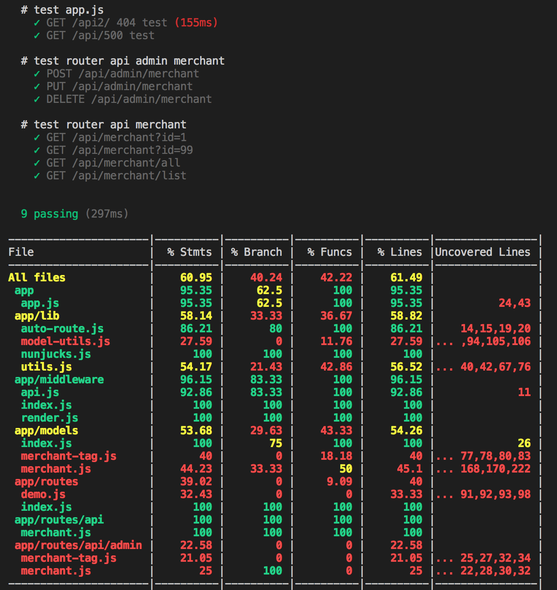

# Express 使用 Mocha、nyc 做单元、覆盖测试

## Mocha

Mocha is a feature-rich JavaScript test framework running on Node.js and in the browser, making asynchronous testing simple and fun. Mocha tests run serially, allowing for flexible and accurate reporting, while mapping uncaught exceptions to the correct test cases.

GitHub仓库：[Mocha](https://github.com/mochajs/mocha)

## nyc

JavaScript test coverage made simple.

GitHub仓库：[nyc](https://github.com/istanbuljs/nyc)

## supertest

The motivation with this module is to provide a high-level abstraction for testing HTTP, while still allowing you to drop down to the lower-level API provided by superagent.

GitHub仓库：[supertest](https://github.com/visionmedia/supertest)

## power-assert

Power Assert in JavaScript. Provides descriptive assertion messages through standard assert interface. No API is the best API.

GitHub仓库：[power-assert](https://github.com/power-assert-js/power-assert)

## 开发环境

* node: v8.9.3
* npm: 5.6.0

以上四个库、框架，都是本地安装，没有全局安装，很多教程中都推荐 `Mocha`、`nyc`全局安装。

在 `package.json` 的 `scripts` 中添加两个命令：

``` json
{
    "scripts": {
        "test": "export NODE_ENV=test PORT=3300 && mocha 'test/**/*.test.js' --exit",
	     "cov": "export NODE_ENV=test PORT=3300 && nyc mocha 'test/**/*.test.js' --exit"
    }
}
```

`--exit` 表示在 `Mocha` 测试结束后，退出所有进程。如果不加这个，在用例中引入的 `Express` 实例会一直运行着，不会退出。

`npm run test` 是测试，`npm run cov` 是测试加覆盖测试，测试用例指定为根目录的 `test` 文件夹下所有 `*.test.js` 文件。

## 测试用例

贴一个简单的测试用例代码

```javascript
// 一个没有监听端口的 Express 实例
const app = require('your-path/app');
// Express 实例传入 supertest，使其运行实例
const request = require('supertest')(app);
// 断言测测试库
const assert = require('power-assert');

describe('# test router api merchant', function () {
    // 同步测试
    it('POST /api/admin/merchant', function() {
        assert(1 === 1);
    });
    // 异步测试
    // 异步中，done 在异步结束后执行
    it('GET /api/merchant?id=1', function (done) {
        request
            .get('/api/merchant?id=1') // 接口地址
            .expect(200) // 判断状态码
            .end(function (err, res) { // 请求结束后拿到返回的数据
                if (err) return done(err);
                assert.equal(res.body.success, true, '商家id为1有值');
                assert(Object.prototype.toString.call(res.body.data) === '[object Object]', '商家信息应该是一个对象');
                assert.equal(res.body.data.id, 1, '商家id为1');
                done();
            });
    });
});

```

控制台运行 `npm run test`，会打印大概如下信息，标识都通过了。

``` bash
# test router api merchant
    ✓ POST /api/admin/merchant
    ✓ GET /api/merchant?id=1 (155ms)
```

## 覆盖测试

控制台运行 `npm run cov`，会打印大概如下信息。

首先是测试用例的情况，然后是代码覆盖的情况。

具体引用了哪些文件，哪些地方没有覆盖到，都会有对应的信息。

为了覆盖的更多，在写测试用例的时候，会对一个接口多写几种不同的状态。




## 暂时就这么多了

暂时就这么多了，感觉挺好玩的。